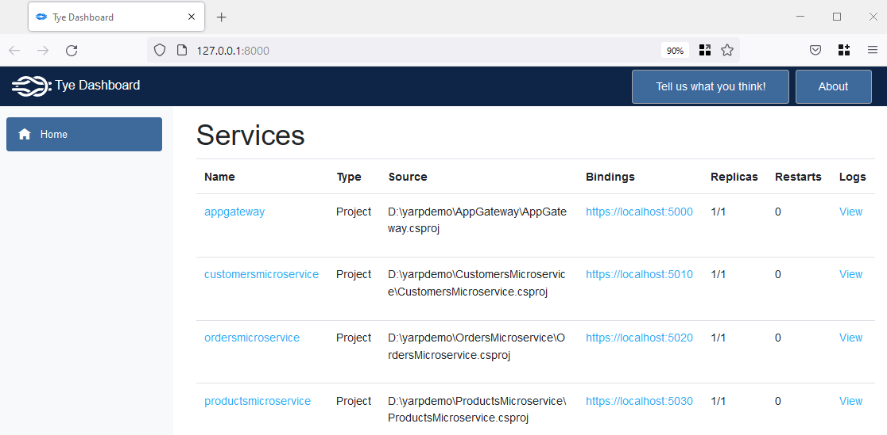

[](https://github.com/aimenux/YarpDemo/actions/workflows/ci.yml)

# YarpDemo
```
Playing with Yarp reverse proxy
```

> In this demo, i m using [Yarp](https://microsoft.github.io/reverse-proxy) in order to build a lightweight app gateway intercepting requests and redirecting them to backend microservices.
>
> The solution is organized as follows :
>
> - `AppGateway` : a webapi with yarp integration and configuration
> - `CustomersMicroservice` : a webapi listing fake customers
> - `OrdersMicroservice` : a webapi listing fake orders
> - `ProductsMicroservice` : a webapi listing fake products
>
> The solution is using [Tye](https://github.com/dotnet/tye) in order to configure and run microservices and app gateway.
>
> In order to run the solution : 
>
>> :one: type `Tye Run` in your favorite terminal 
>>
>> :two: browse the url `https://localhost:5000/api`
>>
>> :three: refresh the url to see [Yarp](https://microsoft.github.io/reverse-proxy) in action
>
> 
>

**`Tools`** : net 8.0, yarp, tye